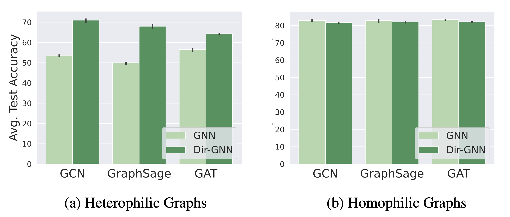

# Dir-GNN: Graph Neural Networks for Directed Graphs 

[](https://paperswithcode.com/sota/node-classification-on-squirrel?p=edge-directionality-improves-learning-on)[](https://paperswithcode.com/sota/node-classification-on-chameleon?p=edge-directionality-improves-learning-on)[](https://paperswithcode.com/sota/node-classification-on-arxiv-year?p=edge-directionality-improves-learning-on)[](https://paperswithcode.com/sota/node-classification-on-snap-patents?p=edge-directionality-improves-learning-on)

<!--  -->
<p align="center">
    
</p>

Dir-GNN is a machine learning model that enables learning on *directed* graphs. This repository contains the official implementation of the paper ["Edge Directionality Improves Learning on Heterophilic Graphs"](https://arxiv.org/abs/2305.10498), where we introduce Dir-GNN and show that leveraging edge directionality leads to improved learning on heterophilic graphs.

- [Dir-GNN: Edge Directionality Improves Learning on Heterophilic Graphs](#dir-gnn-edge-directionality-improves-learning-on-heterophilic-graphs)
  - [Overview](#overview)
  - [Getting Started](#getting-started)
    - [Setting Up the Environment](#setting-up-the-environment)
    - [Installing Dependencies](#installing-dependencies)
    - [Code Structure](#code-structure)
  - [Running Experiments](#running-experiments)
    - [Dir-GNN Experiments](#dir-gnn-experiments)
    - [Ablation Study on Using Directionality](#ablation-study-on-using-directionality)
    - [Synthetic Experiments](#synthetic-experiments)
  - [Dataset Fix](#dataset-fix)
  - [Command Line Arguments](#command-line-arguments)
    - [Dataset Arguments](#dataset-arguments)
    - [Preprocessing Arguments](#preprocessing-arguments)
    - [Model Arguments](#model-arguments)
    - [Training Args](#training-args)
    - [System Args](#system-args)
  - [Citation](#citation)
  - [Contact](#contact)

## Overview

Graph Neural Networks (GNNs) have become the de-facto standard tool for modeling relational data. However, while many real-world graphs are directed, the majority of today's GNN models discard this information altogether by simply making the graph undirected. The reasons for this are historical: 1) many early variants of spectral GNNs explicitly required undirected graphs, and 2) the first benchmarks on homophilic graphs did not find significant gain from using direction. 

In our paper, we show that in heterophilic settings, treating the graph as directed increases the effective homophily of the graph, suggesting a potential gain from the correct use of directionality information. To this end, we introduce Directed Graph Neural Network (Dir-GNN), a novel general framework for deep learning on directed graphs. Dir-GNN can be used to extend any Message Passing Neural Network (MPNN) to account for edge directionality information by performing separate aggregations of the incoming and outgoing edges. 

We prove that Dir-GNN matches the expressivity of the Directed Weisfeiler-Lehman test, exceeding that of conventional MPNNs. In extensive experiments, we validate that while our framework leaves performance unchanged on homophilic datasets, it leads to large gains over base models such as GCN, GAT and GraphSage on heterophilic benchmarks, outperforming much more complex methods and achieving new state-of-the-art results.

## Getting Started

To get up and running with the project, you need to first set up your environment and install the necessary dependencies. This guide will walk you through the process step by step.

### Setting Up the Environment

The project is designed to run on Python 3.10. We recommend using [Conda](https://conda.io/projects/conda/en/latest/user-guide/install/index.html) to set up the environment as follows:

```bash
conda create -n directed_gnn python=3.10
conda activate directed_gnn
```

### Installing Dependencies

Once the environment is activated, install the required packages:

```bash
conda install pytorch==2.0.1 pytorch-cuda=11.7 -c pytorch -c nvidia
conda install pyg pytorch-sparse -c pyg
pip install ogb==1.3.6
pip install pytorch_lightning==2.0.2
pip install gdown==4.7.1
```

Please ensure that the version of `pytorch-cuda` matches your CUDA version. If your system does not have a GPU, use the following command to install PyTorch:

```bash
conda install pytorch==2.0.1 -c pytorch
```

For M1/M2/M3 Mac users, `pyg` (PyTorch Geometric) needs to be installed from source. Detailed instructions for this process can be found [here](https://pytorch-geometric.readthedocs.io/en/latest/notes/installation.html#installation-from-source).

### Code Structure

* `run.py`: This script is used to run the models.

* `model.py`: Contains the definition of the directed convolutions (DirGCN, DirSage, and DirGAT) explored in the paper.

* `homophily.py`: Houses functions for computing the weighted node homophily and the weighted compatibility matrix, as defined in our paper.


## Running Experiments

This section provides instructions on how to reproduce the experiments outlined in the paper. Note that some of the results may not be reproduced *exactly*, given that some of the operations used are intrinsically non-deterministic on the GPU, as explained [here](https://github.com/pyg-team/pytorch_geometric/issues/92). However, you should obtain results very close to those in the paper.

### Dir-GNN Experiments

To reproduce the best Dir-GNN results on heterophilic datasets (Table 3 in our paper), use the following command:

```bash
python -m src.run --dataset chameleon --use_best_hyperparams --num_runs 10
```

The `--dataset` parameter specifies the dataset to be used. Replace `chameleon` with the name of the dataset you want to use. 

### Ablation Study on Using Directionality

Table 2 and 4 contain the results of an ablation study where we compare common undirected GNN models (GCN, GraphSage, GAT) with their Dir-GNN counterpart.

To reproduce the results for the undirected models, run the following command:

```bash
python -m src.run --dataset chameleon --conv_type gcn --num_runs 10 --patience 200 --normalize --undirected 
```

Here, `--conv_type` specifies the convolution type and can be set to `gcn`, `sage` or `gat`.

To instead reproduce the Dir-GNN for different values of $alpha$, use the following commands:

```bash
python -m src.run --dataset chameleon --conv_type dir-gcn --num_runs 10 --patience 200 --normalize --alpha 1
python -m src.run --dataset chameleon --conv_type dir-gcn --num_runs 10 --patience 200 --normalize --alpha 0
python -m src.run --dataset chameleon --conv_type dir-gcn --num_runs 10 --patience 200 --normalize --alpha 0.5
```

In this case, `--conv_type` can be set to `dir-gcn`, `dir-sage` and `dir-gat`.

### Synthetic Experiments

You can run synthetic experiment (Figure 2b) using the following command:

```bash
./run_synthetic_experiment sage
```

You can also replace `sage` with `gcn`, or `gat` to specify the base model to be used in the synthetic experiment and obtain the results in Figure 8.

## Dataset Fix

For Citeseer-Full and Cora-ML datasets, PyG loads them as undirected by default. To utilize these datasets in their directed form, a slight modification is required in the PyG local installation. Please comment out the line `edge_index = to_undirected(edge_index, num_nodes=x.size(0))` in the file located at:

```bash
/miniconda

3/envs/your_env/lib/python3.10/site-packages/torch_geometric/io/npz.py
```

## Command Line Arguments

The following command line arguments can be used with the code:

### Dataset Arguments

| Argument               | Type | Default Value | Description                   |
| ---------------------- | ---- | ------------- | ----------------------------- |
| --dataset              | str  | "chameleon"   | Name of the dataset           |
| --dataset_directory    | str  | "dataset"     | Directory to save datasets    |
| --checkpoint_directory | str  | "checkpoint"  | Directory to save checkpoints |

### Preprocessing Arguments

| Argument     | Action     | Description                     |
| ------------ | ---------- | ------------------------------- |
| --undirected | store_true | Use undirected version of graph |
| --self_loops | store_true | Add self-loops to the graph     |
| --transpose  | store_true | Use transpose of the graph      |

### Model Arguments

| Argument      | Type   | Default Value | Description                         |
| ------------- | ------ | ------------- | ----------------------------------- |
| --model       | str    | "gnn"         | Model type                          |
| --hidden_dim  | int    | 64            | Hidden dimension of model           |
| --num_layers  | int    | 3             | Number of GNN layers                |
| --dropout     | float  | 0.0           | Feature dropout                     |
| --alpha       | float  | 0.5           | Direction convex combination params |
| --learn_alpha | action | -             | If set, learn alpha                 |
| --conv_type   | str    | "dir-gcn"     | DirGNN Model                        |
| --normalize   | action | -             | If set, normalize                   |
| --jk          | str    | "max"         | Either "max", "cat" or None         |

### Training Args

| Argument       | Type  | Default Value | Description                 |
| -------------- | ----- | ------------- | --------------------------- |
| --lr           | float | 0.001         | Learning Rate               |
| --weight_decay | float | 0.0           | Weight decay                |
| --num_epochs   | int   | 10000         | Max number of epochs        |
| --patience     | int   | 10            | Patience for early stopping |
| --num_runs     | int   | 1             | Max number of runs          |

### System Args

| Argument               | Type | Default Value | Description                                      |
| ---------------------- | ---- | ------------- | ------------------------------------------------ |
| --use_best_hyperparams | flag |               | If specified, use the best hyperparameters       |
| --gpu_idx              | int  | 0             | Indexes of GPU to run the program on             |
| --num_workers          | int  | 0             | Number of workers for the dataloader             |
| --log                  | str  | "INFO"        | Log Level. Choices: ["DEBUG", "INFO", "WARNING"] |
| --profiler             | flag |               | If specified, enable profiler                    |


## Citation

```bibtex
@misc{dirgnn_rossi_2023,
    title={Edge Directionality Improves Learning on Heterophilic Graphs},
    author={Emanuele Rossi and Bertrand Charpentier and Francesco Di Giovanni and Fabrizio Frasca and Stephan Günnemann and Michael Bronstein},
    publisher={arXiv},
    year={2023}
}
```

## Contact
If you have any questions, issues or feedback, feel free to reach out to Emanuele Rossi at `emanuele.rossi1909@gmail.com` or Bertrand Charpentier at `bertrand.henri.charpentier@gmail.com`.

